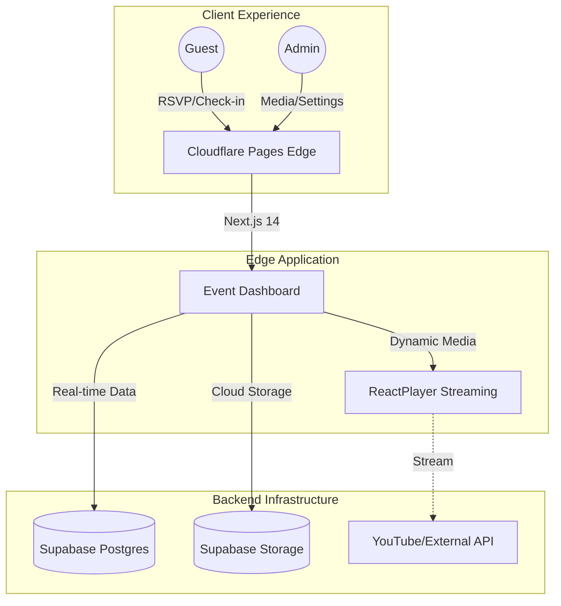

# 🏛 Buna House Event Platform ☕️

A premium, edge-first event invitation and RSVP platform designed for the **Buna House Opening Ceremony**. Built with **Next.js 14**, optimized for **Cloudflare Pages**, and powered by **Supabase**.

🔗 **Live Application URL**: [https://event.ethio-viral.com/](https://event.ethio-viral.com/)

---

## 🏛 Platform Architecture

The platform is architected for low latency and high availability using a serverless approach.



---

## ✨ Premium Features

### 🎵 Enhanced Multi-Source Music
Our music engine now supports a **dual-input system** managed directly from the Admin Dashboard:
-   **Direct MP3 Uploads**: High-fidelity audio hosted locally on Supabase.
-   **YouTube & External Streaming**: Instant integration via YouTube URLs for a dynamic atmosphere.
-   **Smart Priority**: The system automatically prioritizes custom uploads while falling back to external links or default tracks.

### 🖼 Professional Visual Experience
-   **High-Res Logo Integration**: Consistent branding from the favicon to the hero section.
-   **Dynamic Media Slots**: Real-time management of images and background assets.
-   **Mobile-First Design**: Smooth animations and responsive transitions for a luxurious mobile experience.

### 📊 Real-time RSVP Management
-   **Personalized Invitations**: Unique links for honored guests.
-   **Dynamic Guest List**: View attendance and guest messages in real-time.
-   **Admin Control Panel**: Secure, PIN-protected dashboard for all event configurations.

---

## 🛠 Technology Stack

-   **Frontend**: [Next.js 14](https://nextjs.org/) (App Router, Edge Runtime)
-   **Deployment**: [Cloudflare Pages](https://pages.cloudflare.com/) ⚡️
-   **Database**: [Supabase](https://supabase.com/) (Postgres + Storage)
-   **Audio Engine**: [React Player](https://www.npmjs.com/package/react-player)
-   **Styling**: Vanilla CSS + TailwindCSS + Google Fonts (Ovo, Inter)

---

## 🚀 Deployment & Configuration

### Environment Setup
Standard configuration required in `.env.local`:
```env
NEXT_PUBLIC_SUPABASE_URL=...
NEXT_PUBLIC_SUPABASE_ANON_KEY=...
SUPABASE_SERVICE_ROLE_KEY=...
ADMIN_PIN=...
```

### Build Pipeline
Optimize for the edge using the native adapter:
```bash
# Production Build
npm run pages:build

# Deployment Target
.vercel/output/static
```

---

© 2026 Buna House. *Crafting coffee, community, and experiences.*
