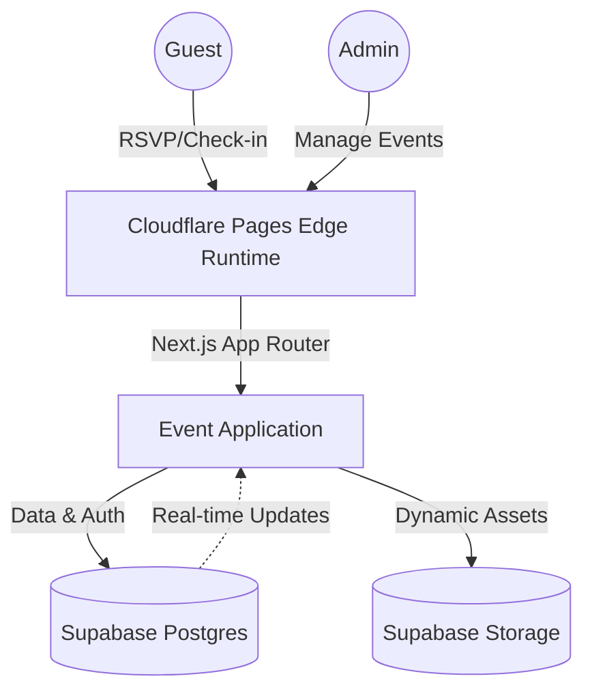

# Buna House Event Platform ☕️

A sophisticated, modern event management platform for the **Buna House Opening Ceremony**. Built with Next.js and deployed on Cloudflare Pages, this platform provides a seamless RSVP experience for guests and a powerful administrative dashboard for event organizers.

🔗 **Live Platform**: [event.ethio-viral.com](https://event.ethio-viral.com/)

---

## 🏛 System Architecture

The platform leverages a serverless, edge-first architecture to ensure maximum performance and global availability.



---

## ✨ Key Features

-   **Dynamic Event Invitations**: Personalized invitation pages with unique slugs for guests.
-   **Seamless RSVP Flow**: Interactive forms for guest confirmation and attendance tracking.
-   **Admin Dashboard**: Secure control panel for managing guest lists, event details, and branding.
-   **Edge Performance**: Deployed on Cloudflare's global network for sub-100ms response times.
-   **Rich Aesthetics**: Vibrant, premium design with custom typography and smooth animations.

---

## 🛠 Tech Stack

-   **Framework**: [Next.js 14](https://nextjs.org/) (App Router)
-   **Runtime**: [Cloudflare Pages](https://pages.cloudflare.com/) (Edge Runtime)
-   **Database & Auth**: [Supabase](https://supabase.com/)
-   **Styling**: Vanilla CSS & TailwindCSS
-   **Icons**: React Icons

---

## 🚀 Getting Started

### Prerequisites

-   Node.js 18+
-   Supabase Project
-   Cloudflare Account (for deployment)

### Environment Variables

Create a `.env.local` file with the following:

```env
NEXT_PUBLIC_SUPABASE_URL=your_supabase_url
NEXT_PUBLIC_SUPABASE_ANON_KEY=your_anon_key
SUPABASE_SERVICE_ROLE_KEY=your_service_role_key
ADMIN_PIN=your_admin_pin
```

### Installation

```bash
# Install dependencies
npm install

# Run the development server
npm run dev

# Build for Cloudflare Pages
npm run pages:build
```

---

## ⚙️ Deployment

The project is optimized for Cloudflare Pages using the `@cloudflare/next-on-pages` adapter.

1.  Push changes to GitHub.
2.  Connect the repository to Cloudflare Pages.
3.  Configure environment variables in the Cloudflare Dashboard.
4.  Set the build command to `npm run pages:build` and the output directory to `.vercel/output/static`.

---

© 2026 Buna House. All rights reserved.
